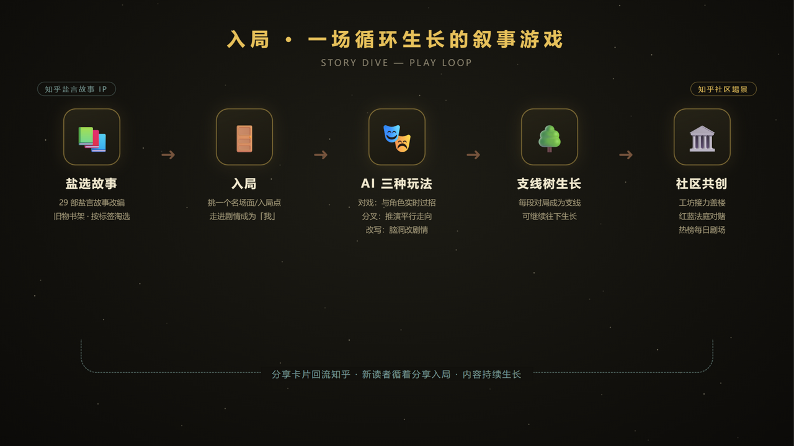
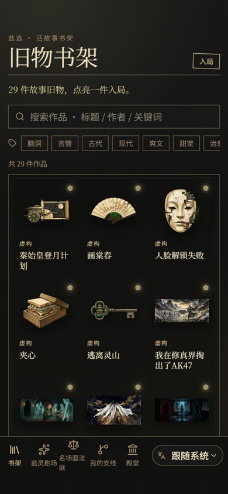
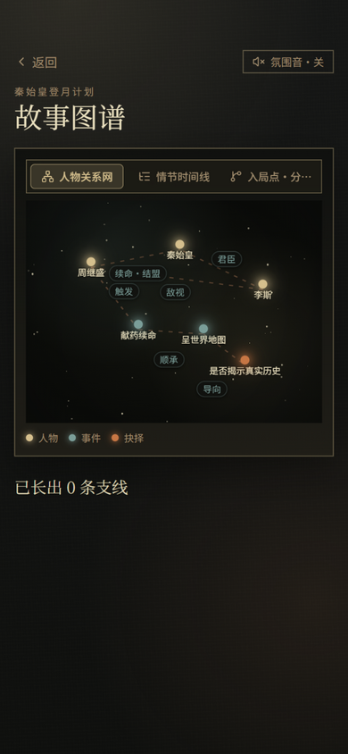
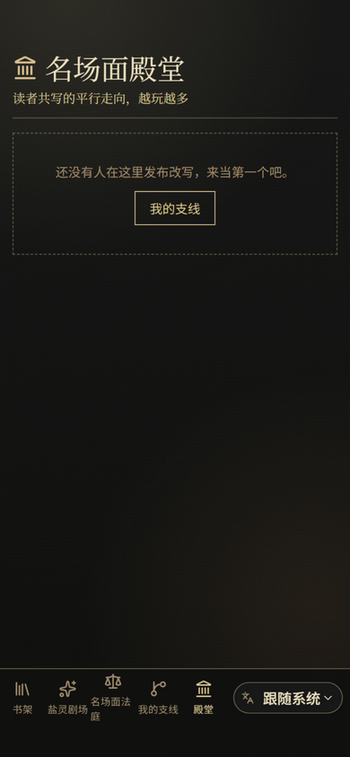
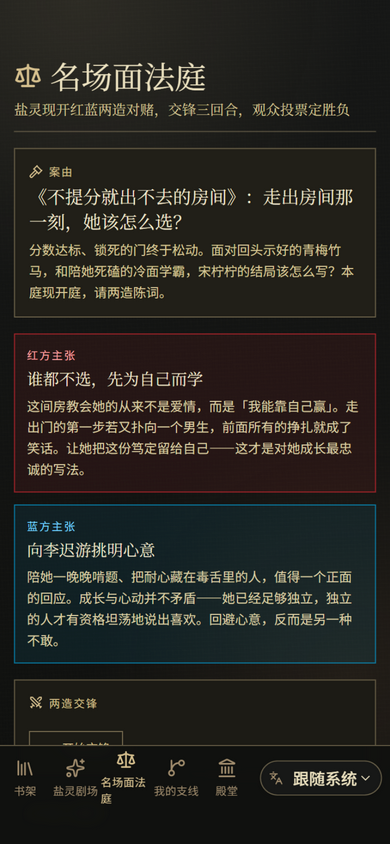
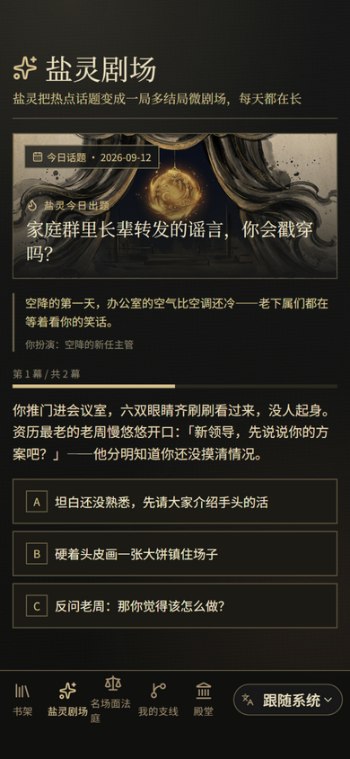
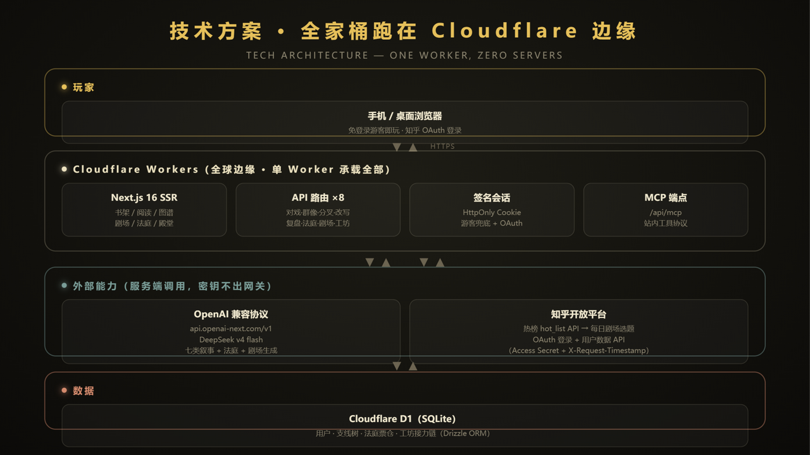

# 入局 · 知乎盐言故事互动叙事游乐场
## 产品说明计划书

> **赛道**：跨次元游乐场 —— AI 游戏与互动叙事
> **体验地址**：https://storydive-10wtw01.org （国内直连；游客可预览，知乎登录解锁全部玩法）
> **一句话介绍**：把知乎盐言故事变成可以"玩"的互动叙事游乐场——读者走进名场面与角色对戏、推演分叉、改写剧情，看山在旁伴读、引用的都是知乎上真实的回答；玩家长出的故事送进社区，与所有人接力、对赌、共演。

---

## 一、创作思路：从"读完即止"到"入局即玩"

### 我们观察到的三个问题

**1. 盐选故事的体验是单向的。**
知乎盐言故事积累了大量高质量短篇（校园、言情、悬疑、历史、脑洞……），读者的典型路径是：点开 → 追更 → 读完 → 关闭。情绪浓度在"读完那一秒"达到峰值，却没有任何出口——想跟主角说句话、想改一个结局、想看看"如果当初"，都无处安放。

**2. 社区的共创冲动缺少"叙事容器"。**
知乎天然有观点对抗（红蓝视角、高赞反驳）和续写接力的传统，但文字评论区的共创是碎片化的：盖楼会歪楼，续写会失散。社区缺一个**结构化的叙事容器**，让"接得下去、对得起来、留得下来"。

**3. 热榜议题与故事消费是两个世界。**
热榜是知乎每天最大的流量心智，但它以"议题"存在，缺少戏剧化的演绎入口。如果热榜上的"第一次当领导被下马威"能变成一局可以亲自玩的迷你剧呢？

### 我们的解法

把**盐选故事 IP** 作为内容底座，把**名场面**作为入口：读者不再是读者，而是"入局者"——走进故事的关键时刻，与 AI 驱动的角色实时对戏；每一个选择都长出一条支线；每一条支线都可以发布到公共工坊，被别人接力续写、点赞、开庭对赌；刘看山在旁伴读，引用的是知乎上真实的回答；每天还有一局由知乎热榜话题现生成的"盐灵剧场"。

故事不再被"读完"，而是被"玩起来、长下去"。

---

## 二、产品详解：八个场景走完一圈

### 2.1 旧物书架 —— 29 部盐选故事的入口

首页是一座暗色调的「旧物书架」：每部作品不是一张封面卡，而是**一件故事旧物**——写满错题的卷子、一枚外戚印信、一把佛塔钥匙、一片垂落的人皮。"点亮一件旧物，入一个局"。支持按标题/作者搜索，脑洞、言情、悬疑、历史等 60+ 标签一筛即得。

### 2.2 阅读 + 故事图谱 —— 先看懂，再入局

点开旧物即进入导读式正文（原创复述，尊重原作版权并署名来源），每章配场景插画。右上角随时展开**故事图谱**：人物关系网（星座式星图，节点可拖拽重排，连线标注"君臣""敌视""续命·结盟"）、情节时间线、入局点分支树——先用 30 秒建立空间感，再决定从哪里入局。

**阅读排版系统**（对标微信读书 / 豆瓣阅读）：顶栏「排版」面板提供三款开源字体，按衬线/无衬线分类——衬线：**思源宋体**（文学沉浸，默认）与**霞鹜文楷 GB 屏幕版**（温暖文艺，专为屏幕渲染调校）；无衬线：**思源黑体**（快速屏读）。英文分别配对 Literata（Google Play Books 御用阅读字体）与 Geist，全部为 SIL OFL 开源授权、构建时自托管，**零版权风险、零第三方运行时请求**。字号（12–32px，1px 步进）、行距（1.5–2.4 十档）、字间距、段间距四项细粒度可调、即时生效，章节标题随字号联动缩放；霞鹜文楷按 unicode-range 切成 97 片 woff2 按需加载（全量 4.7MB，首屏仅拉取几十 KB）。设置本地与 Cookie 双写，服务端直出首帧排版，**刷新零闪烁**，并配 `font-synthesis: none` 等渲染策略保证不同字号下清晰锐利无毛边。

### 2.3 AI 三种玩法 —— 对戏、分叉、改写

每个入局点提供三种与 AI 实时交互的玩法：

- **对戏**：以"我"的身份与场景内角色实时对话。AI 以角色人设卡（性格/立场/说话方式）+ 已读剧情为上下文，角色"记得"你说过的话，敌视你的角色句句带刺，暗恋你的角色欲言又止。
- **分叉**：在关键选择处，AI 推演一条平行走向的完整剧情——"如果她没有接那通电话"。
- **改写**：给一个脑洞设定，AI 顺着原作文风续写改篇——"如果秦始皇收到了一份世界地图"。

此外还有**群像**（多位角色同场交锋）、**复盘**（对纪实类作品的选择进行推演反思）与**引经据典**（对戏开关：角色以自己的口吻引用知乎上真实的高赞回答，[n] 编号可点开验证）。

### 2.4 支线树 —— 你的每一次选择都被记住

每段对局自动存为一条**支线**：属于你个人的叙事树，支持从任意支线节点"继续往下玩"，长出子节点。这是读者自己的故事资产，也是后续所有社区玩法的原料。

### 2.5 二创工坊 —— 接力盖楼的公共内容池

支线可以"发布"进公共殿堂：别人可以在你的改写之后**接力盖楼**（形成一条链）、**点赞**（热度加权排序，新内容有 48 小时新鲜度加成）。这是知乎"回答接力"传统的游戏化重建。

### 2.6 名场面法庭 —— 双 Agent 对抗 + 社区判决

辩题采用「**每日一题 + 现取名场面**」双轨：默认开庭是全站统一的**今日辩题**——从用户知乎画像推荐的真实问题中经 AI 改写成的红蓝案由（推荐不可用时自动降级到本地案由池，永不空场）；点「换一桩」则从案由池现取另一桩**故事名场面或热点话题**另开一庭，票仓按案由全站聚合。红蓝两造由**两个独立人格的辩手 Agent** 实时对抗：红方「烈盐」（故事党）情绪饱满、金句频出；蓝方「析盐」（逻辑党）冷静拆解、专戳漏洞。每一回合都是真实生成——后者看得到前者刚说出口的话再回击，而非预排好的台词。三回合后观众**投票定胜负**、可改投、实时票仓，盐官依票数宣读判词。

法庭还会"看着观众变强"：按你的历史投票自适应难度（初阶 → 进阶 → 高阶），你常站的哪一方，对面的 Agent 就重点针对哪一方下钩子。判词可生成水墨判决书海报，或一键生成**知乎原生想法文案**（话题标签 + 判决金句 + 钩子提问 + 回访链接，可编辑）复制发布。

### 2.7 盐灵剧场 —— 热榜驱动的每日一局

调用知乎开放平台热榜 API，把当日热点话题喂给 AI，现生成一局"多结局微剧场"：你扮演话题中的当事人，三五个选择走出 good / bad / twist / open 四种结局。热榜一天一取、按日轮换选题，**天然日更**；接口不可用时自动降级到本地话题池，永不空场。

### 2.8 刘看山伴读 —— 知乎直答驱动的阅读向导

阅读页右下角住着一只**刘看山**：可拖拽、可隐藏（退场/入场带动画），翻到新章节会晃悠过来打招呼。它知道你正在读哪本书、读到哪一段——聊天时结合当前剧情回应，并调用**知乎直答与站内搜索**，把真实的高赞回答化进自己的话里（[n] 编号可点开验证原文）；未接入知乎凭据时自动降级为站内大模型闲聊，永不失联。**故事里的引用都是真的。**

---

## 三、技术方案：一个 Worker，零台服务器

### 3.1 全栈跑在 Cloudflare 边缘

Next.js 16（App Router）+ React 19 构建的前端与服务端 API，经 OpenNext 适配为**单个 Cloudflare Worker**：SSR 渲染、10+ 组 API 路由、静态资源、签名会话全部同源承载，国内直连访问 1.5s 内打开。数据层使用 Cloudflare D1（SQLite），Drizzle ORM 管理 7 张表（用户、支线、工坊发帖、工坊投票、法庭票仓、法庭案由缓存、用户画像）。

### 3.2 AI 层：一个 OpenAI 兼容接口驱动全部 AI 能力

服务端统一通过 **OpenAI 兼容协议**（`api.openai-next.com/v1`，DeepSeek v4 flash）调用，一个 SDK 接口覆盖站内全部 AI 能力：对戏、群像、分叉、改写、复盘、法庭双 Agent 攻防与判词、剧场生成、看山伴读、想法文案。每类能力有独立的 System Prompt 工程（人物设定卡 + 人物关系图谱 + 已读正文作为上下文锚点，需要时注入知乎真实回答），AI 不可用时全链路降级兜底（静态剧场、本地话题池、手写辩词），**Demo 永不空场**。

### 3.3 深度使用知乎开放平台（合规、官方、六项已接入）

- **热榜 API**（`content/hot_list`）：盐灵剧场的每日选题源。应用层做"一天一取"缓存 + 并发去重 + 按日确定性轮换，尊重接口额度。
- **站内搜索 API**（`content/zhihu_search`）：伴读与「引经据典」的真实回答来源。query 级缓存 + in-flight 去重 + 失败负缓存，额度受限时静默降级为不引用的纯角色戏。
- **知乎直答 API**（OpenAI 兼容 chat/completions）：看山伴读的大脑，把检索到的真实回答化进角色口吻输出。
- **OAuth 登录**（黑客松授权流程）：知乎账号一键登录，授权码换 token 全程在服务端完成。
- **用户基础信息 API**（`openapi/user`）：以平台 `hash_id` 作为站内稳定用户标识，昵称与头像来源；登录即升级，游客由中间件自动发放**签名游客会话**，全部玩法零门槛预览。
- **用户数据 API**（`user/contents`，Access Secret + X-OAuth-Token + 时间戳）：资料获取的兜底通道。

### 3.4 工程可靠性

- 全链路降级：AI 不可用 → 静态兜底剧场；热榜/搜索失败 → 本地话题池、不引用降级；未登录 → 游客会话；单图加载失败 → 渐变占位；法庭 Agent 失败 → 风格化兜底辩词。
- 分享物料为纯前端 Canvas 绘制（名场面卡 / 法庭判决书两种海报），Web Share API 分享、剪贴板兜底。
- 提供站内 MCP 端点（`/api/mcp`），为 Agent 生态预留工具协议入口。

---

## 四、适配知乎社区的场景价值（重点）

**1. 为盐选故事资产创造"第二消费场景"。**
盐选故事是知乎最独特的内容 IP 库。入局让每一部作品从"一次性阅读"变成"可反复入局的互动体验"——读过的想回来玩个不同结局，没读过的玩完想去读原文，**为内容生态互相导流**。

**2. 把知乎的社区文化装进游戏机制。**
- 观点对抗 → **双 Agent 法庭**：知乎用户最爱"站队讲理"，法庭给这场站队一个有戏剧感、有结果、可分享的容器——且辩手会记住观众立场、随社区投票进化；
- 续写接力 → **二创工坊**：盖楼不再歪楼，每楼都是链上可溯的一格；
- 热榜议题 → **盐灵剧场**：每天用热榜出题、全场共答，议题变成 playable 的内容。

**3. 分享回流，闭环长在知乎里。**
对局结束一键生成**名场面分享卡 / 水墨判决书海报**；判决书还能生成**知乎原生想法文案**（带话题标签与回访链接）复制发布——"我在《不提分就出不去的房间》里和李迟游对了一局戏"——新读者循着想法点进来，又成为一个入局者。内容生长的循环，锚点始终在知乎社区。

**4. 看山 IP 的叙事化使用。**
看山不是吉祥物贴纸：它是知道你读到哪、会引用真实社区回答、会为你刚翻开的章节晃悠过来打招呼的伴读 Agent。赛道点名的「看山 IP 延展」在此落成一个有功能、有性格、有记忆的角色，而非一层皮肤。

**5. 官方能力，合规生长。**
全部社区数据（热榜、搜索、直答、登录、用户资料）来自知乎开放平台官方接口，密钥仅存服务端（Cloudflare Secrets），调用侧做了缓存与额度保护——作品的生命周期不依赖任何灰色手段。

---

## 五、差异化定位：与《入戏》等同类作品不在同一轨道

上一届知乎黑客松获奖作品《入戏》（基于盐选小说库的沉浸式互动文游）验证了"进小说扮演角色、改写剧情"的可行性。入局从同一片内容土壤出发，但刻意走在三条不同的轨道上：

**1. 《入戏》让玩家"走进故事"；入局让"故事与社区互相流动"。**
入局的法庭判决以知乎原生想法文案回流社区，工坊支线被公开接力、点赞、开庭——内容循环的终点落在知乎社区，而非停留在产品内。产品即社区的一环，不只是一个游戏。

**2. 《入戏》的 NPC 是纯 AI 角色；入局的引用"都是真的"。**
看山伴读与对戏角色由知乎直答与站内搜索驱动，发言里的 [1][2] 是可点开验证的真实高赞回答——AI 叙事产品最难建立的"信任感"，来自知乎社区本身的内容资产。

**3. 《入戏》聚焦单人剧游；入局把"人的网络"织进玩法。**
真实观众投票定判决、双 Agent 依观众历史立场动态变招、看山以官方 IP 身份伴读答疑——人—Agent—人三层互动（赛道期待方向），而非人—AI 两层。

---

## 六、当前完成度

- 29 部盐言故事完成互动化改编（25 部虚构 + 4 部纪实复盘），含场景插画与人物关系图谱
- 全部 AI 能力可用：对戏/群像/分叉/改写/复盘/法庭双 Agent 攻防与判词/剧场/看山伴读/想法文案
- 8 大社区模块全部上线：支线树、工坊接力、双 Agent 法庭、每日剧场、分享海报、想法回流、看山伴读、引经据典
- 知乎开放平台六项能力接入并上线（热榜/搜索/直答/OAuth/用户信息/用户数据），知乎账号真机登录已打通
- 阅读排版系统上线：衬线/无衬线三款开源字体（思源宋体 / 霞鹜文楷 GB 屏幕版 / 思源黑体，中英文配对），字号 / 行距 / 字间距 / 段间距四项细粒度调节，即时生效、跨页记忆、刷新零闪烁
- Cloudflare 全球边缘部署、游客 + 知乎账号双会话体系、中英双语、移动端优先（底栏五项对齐、书架分类「更多」全览面板、窄屏顶栏自适应换行）

## 七、下一步规划：把知乎开放平台用到更深

技能包 0.7.2 已给出完整的官方契约，以下每一步都对应一个已核验的开放接口。**第 1-5 项已全部实现上线**（2026-09-13，含 AI 用户画像地基），实现细节：

1. ✅ **辩手引用真实回答**（`content/question_answers` 回答摘要 API）：法庭攻防升级为"论据战"——烈盐引共情回答、析盐引数据回答（关键词启发式分池），[n] 编号点开可展开摘要并跳转原回答验证（`question_answers` 无赞同数字段，用一次站内搜索交叉标注）；看山伴读获得"深挖这个问题"模式（`/api/court/deepdive`：问题回答摘要 + 直答综述）。每日案由落库 `court_cases`，证据池按问题当日缓存
2. ✅ **今日辩题来自你的画像**（`user/question_recommendations` 问题推荐 API）：采用"**同题+个性化演绎**"——全站每日一题由画像模式推荐的真实知乎问题经 AI 改写成红蓝案由（`court_votes` 按 caseId 聚合的全站对战氛围保留），"为你而设"体现在旁听席画像注入立论/陈词、证据按兴趣重排、观众立场钩子；解析链：D1 当日缓存 → 画像推荐 → 本地案由池，永不空场
3. ✅ **把你的知乎写进故事**（`user/contents` 创作数据 API，经 OAuth 显式授权）：`/api/user/sync` 同意后同步高赞回答 20 条 → AI 提炼画像 + 判例卡落库 `user_profiles`。判例卡三处消费：对戏"知乎灵魂"（角色可点破"你自己也写过…"）、盐官判词（点出投票与 TA 写过的东西的呼应）、想法文案（"作为一个写过…的人"自指口吻）。OAuth token 1 小时过期无刷新 → 登录时同步 + D1 缓存提炼结果，过期引导重新授权
4. ✅ **关注的人走进故事**（`user/followees` 关注列表 API）：独立同意开关拉取公开资料（昵称/一句话介绍/头像）存影子卡；群像对戏"邀请影子"选 1-2 位关注的人以"影子客人"身份入席（AI 想象演绎、非本人发言、以 headline 气质点评剧情）
5. ✅ **知识库 RAG 定制剧场**（knowledge API）：剧场页新增"定制剧场"——<5000 字直接注入 prompt 不上传；长文/文件（≤20MiB）上传知乎知识库（UI 明示且平台无删除接口）→ `knowledge/search` 检索知识点块（40005 处理中自动轮询）→ 多结局学习剧场，结局 verdict 承载知识点复盘
6. **AI 用户画像**（新增地基）：一次 AI 调用从判例卡提炼 `UserProfile{keywords/interests/tone/summary}`，法庭旁听席、剧场选材、对戏灵魂全部消费同一份画像；一键清除随时撤回。**冷启动三件套**：创作不足 3 条时自动用「近期收藏」（`user/collections`）与知乎签名（`/user` 的 headline/description）补位提炼；空账号也能在群像对戏里请「知乎高赞旅人」（话题下高赞答主，纯公开资料）当影子客人——没有任何账号会被挡在个性化体验之外
7. **盐选故事 API 动态书架**（黑客松 story 接口已验证）：书架从 29 部长成一片森林，随盐选更新自动生长
8. **想法一键直发**（待平台开放发布能力）：想法回流从"原生文案 + 复制"升级为站内一键发布

---

*本项目为 2026 知乎黑客松参赛作品「跨次元游乐场：AI 游戏与互动叙事」赛道。所有改编作品的正文均为剧情导读式原创复述，版权归原作者所有，来源已在站内逐篇署名。*
